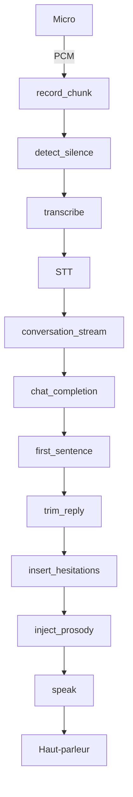

# Anti‑Scam Bot – Rapport & Mode d’Emploi

> **Objet** : Développer un bot vocal pour faire perdre du temps aux arnaqueurs téléphoniques, via STT → LLM → TTS.  
> **Version** : v1.0 – 20 avril 2025  
> **Auteurs** : DJONDANG Aoudou  

---

## Table des matières

1. [Contexte et objectifs](#contexte-et-objectifs)  
2. [Pré­requis](#pré­requis)  
3. [Installation](#installation)  
4. [Configuration des clés](#configuration-des-clés)  
5. [Usage](#usage)  
   - [Mode terminal](#mode-terminal)  
   - [Mode Web (Flask/SSE)](#mode-web-flasksse)  
6. [Architecture & Modules](#architecture--modules)  
   - [`prompts.py`](#promptspy)  
   - [`voice.py`](#voicepy)  
   - [`utils.py`](#utilspy)  
   - [`emotion.py`](#emotionpy)  
   - [`llm_client.py`](#llm_clientpy)  
   - [`bot_core.py`](#bot_corepy)  
   - [`app.py`](#apppy)  
   - [`templates/index.html`](#templatesindexhtml)  
7. [Roadmap & améliorations futures](#roadmap--améliorations-futures)   

---

## Contexte et objectifs

Les arnaqueurs téléphoniques usent de scénarios (faux gains, faux frais, etc.) pour soutirer argent et données.  
Ce projet propose un **bot automatisé** qui :

- Répond cinq secondes après chaque prise de parole de l’arnaqueur ;
- Simule une victime naïve (Michel CASPER, 45 ans, Paris) avec hésitations, lapsus, digressions timbrées ;
- Transporte l’audio de l’arnaqueur en texte (Google Cloud STT) → génère réponse LLM (Qwen2.5 via Nebius) → synthétise en voix naturelle (Google Cloud TTS + SSML) ;
- Propose deux modes d’usage : **terminal** et **interface Web** (Flask + SSE).

L’objectif est **de maximiser le temps perdu** par l’arnaqueur, tout en restant crédible.

---

## Pré­requis

1. **OS** : Linux/macOS (Windows possible mais non testé).  
2. **Python ≥ 3.9** + `python -m venv .venv`  
3. **Outils système** (via apt/brew/choco) :
   ```bash
   sudo apt install ffmpeg portaudio19-dev mpg123 pavucontrol
   ```
4. **Clés API** :
   - Google Cloud Speech‑to‑Text & Text‑to‑Speech (Service Account JSON)  
   - Clé Nebius (LLM)  

---

## Installation

```bash
git clone https://github.com/Djondang/anti-scam-bot.git
cd anti‑scam‑bot

# 1. Environnement virtuel
python -m venv .venv
source .venv/bin/activate

# 2. Dépendances Python
pip install -r requirements.txt

# 3. Outils système (Ubuntu/Debian)
sudo apt update
sudo apt install ffmpeg portaudio19-dev mpg123
```

---

## Configuration des clés

1. **Google** :
   - Crée un Service Account, active STT & TTS APIs.  
   - Télécharge le JSON → place-le (ex. `creds/key.json`).  
   - Dans `.env` (à copier depuis `.env.example`) :
     ```ini
     GOOGLE_APPLICATION_CREDENTIALS=/chemin/vers/creds/key.json
     ```
2. **Nebius** :
   - Crée une clé API dans le portail Nebius.  
   - Dans `.env` :
     ```ini
     NEBIUS_API_KEY=hf_xxx
     ```

---

## Usage

### Mode terminal

```bash
source .venv/bin/activate
python src/main.py
```

- Parle dans le micro : **tu** joues l’Escroc.  
- Michel répond dans tes enceintes (via `mpg123`) et dans ta console.

### Mode Web (Flask/SSE)

```bash
source .venv/bin/activate
python app.py
```

- Ouvre http://localhost:8000  
- Clique **Démarrer**, parle dans ton micro ; l’interface affiche en temps réel :
  - Escroc : …  
  - Michel : …  
- Clique **Arrêter** pour couper la session.

---

## Architecture & Modules



### `src/prompts.py`

- Constructions du **prompt système** :  
  - Contexte, description de l’arnaque  
  - Personnalités aléatoires (Michel / variants)  
  - Règles strictes : 1 phrase, 1 question max, pas de conseil, pas d’évocation d’“arnaque” avant introduit par l’escroc.  
  - Marqueurs négatifs (`[pause]`, `[euh]`, etc.).

### `src/voice.py`

- `record_chunk(seconds)` : enregistre 5 s en mono 48 kHz.  
- `detect_silence(chunk)` : webrtcvad sur frames 10 ms.  
- `transcribe(chunk)` : Google Cloud STT → texte.  
- `speak(ssml)` : Google Cloud TTS en MP3, joué via `mpg123`.

### `src/utils.py`

- `insert_hesitations(text)` : injecte `[pause]`, `[euh]`, …  
- `trim_reply(text)` : coupe à 25 mots max.  
- `first_sentence(text)` : garde jusqu’au 1er `?` ou `.`.  
- `is_greeting_only(text)` : détecte salutations courtes.  
- `is_meaningful(text)` : ≥ 3 mots ou “?” → déclenche LLM.  
- `to_ssml(text)` : convertit `[pause]`, `[hum]` en `<break/>`.

### `src/emotion.py`

- `inject_prosody(text)` : entoure en `<speak><prosody …>…</prosody></speak>` aléatoire  
  → variations de pitch / rate / volume.

### `src/llm_client.py`

- `InferenceClient(provider="nebius")` streaming.  
- `chat_completion(messages)` : itérateur synchrone, 120 tokens max, température 0.9.

### `src/bot_core.py`

- `conversation_stream()` : transforme `main.py` en générateur SSE.  
- Logique identique : silence → digression, salutations courtes, phrase significative → LLM.

### `app.py`

- Serveur Flask minimal.  
- `/stream` : SSE `data: {...}`.  
- `/` : `templates/index.html`.

### `templates/index.html`

- Affichage “chat bubbles” CSS pur.  
- JS SSE (`EventSource("/stream")`): append messages au DOM.

---

## Roadmap & améliorations futures

1. **Mémoire de conversation** : résumés pour limiter le contexte LLM.  
2. **Multi‑personnalités** : profils variés, accents régionaux.  
3. **Dashboard avancé** : contrôle du volume, indicateur “temps perdu”, réglage TEMPERATURE.  
4. **Bot téléphonique cloud** : intégration Twilio / Plivo pour appels automatisés.  
5. **Docker & CI/CD** : image conteneur, tests automatiques, déploiement sur Heroku/Render.

---
